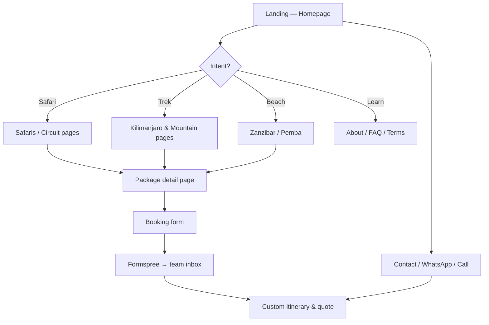

# Wild Gaze Safaris — Official Website

A premium static web platform for **Wild Gaze Safaris Ltd**, a Tanzania-based safari and trekking operator headquartered in **Iringa**. The site showcases curated itineraries across the Northern, Southern, and Western circuits, Kilimanjaro routes, beach holidays, and custom trip planning.

> Fresh repository — initial release of the public marketing site.

---

## What Makes This Project Unique

| Differentiator | Description |
|----------------|-------------|
| **Southern Circuit expertise** | Home turf in Iringa — deep focus on Ruaha, Nyerere (Selous), Mikumi, and Udzungwa, not just the typical Northern Circuit copy. |
| **Dual-circuit coverage** | One operator, two worlds: Serengeti & Ngorongoro in the north **and** remote southern wilderness with fewer crowds. |
| **Integrated trekking hub** | Kilimanjaro (Machame, Rongai, Lemosho) and regional peaks (Meru, Udzungwa, Uluguru, Usambara, Mahale) under one brand. |
| **Safari + beach in one journey** | Zanzibar and Pemba woven into circuit pages and footer journeys — full Tanzania trip planning. |
| **Custom safari-first UX** | Gold/earth design system, mega-menu by activity type, package cards with duration/parks/wildlife tags, and SafariBookings social proof. |
| **Lightweight & host-anywhere** | Pure static HTML — fast on shared hosting, no database, no CMS lock-in. |

---

## User Requirements

### Primary users

1. **International travellers** researching Tanzania safaris, treks, or beach extensions.
2. **Couples & families** comparing multi-day packages (4–9 days) by circuit, parks, and season.
3. **Adventure trekkers** evaluating Kilimanjaro routes by difficulty, days, and success profile.
4. **Repeat / referral guests** returning via SafariBookings, TripAdvisor, or word of mouth.

### Functional requirements

| ID | Requirement | Priority |
|----|-------------|----------|
| UR-01 | Browse safari packages by duration, circuit, and highlighted wildlife | Must |
| UR-02 | View destination detail pages (parks, mountains, islands) | Must |
| UR-03 | Understand company story, accommodation standards, and booking terms | Must |
| UR-04 | Submit a booking inquiry with dates, group size, and package preference | Must |
| UR-05 | Contact via phone, email, WhatsApp, and social links | Must |
| UR-06 | Read FAQ and cultural/birding specialty offerings | Should |
| UR-07 | Access car rental information for self-drive or transfers | Should |
| UR-08 | See verified guest reviews (SafariBookings integration on homepage) | Should |

### Non-functional requirements

- **Performance:** Static assets, preloaded fonts, WebP images where possible.
- **Mobile:** Responsive navbar with hamburger menu and touch-friendly cards.
- **Accessibility:** Semantic headings, alt text on key imagery, readable contrast on dark nav.
- **Maintainability:** Shared navbar/footer patterns across pages; edit once per section when updating.
- **Hosting:** Apache-compatible; works on any static host (cPanel, Netlify, Cloudflare Pages).

---

## User Workflow



### Typical journeys

1. **Safari planner:** Home → Safaris → Package (e.g. 6 Days Selous & Ruaha) → Booking form → confirmation email.
2. **Kili climber:** Home → Trekking → Machame route page → Booking form.
3. **Circuit researcher:** Northern / Southern / Western circuit overview → linked parks → related packages.
4. **Quick inquiry:** Any page → Contact or footer CTA → phone / email / WhatsApp.

---

## Site Map (33 pages)

| Section | Pages |
|---------|-------|
| Core | `index`, `about-us`, `contact-us`, `booking-form`, `faq`, `terms-condition`, `Accomodation`, `car-rental` |
| Safaris | `safaris` + 9 package pages |
| Circuits | `tanzania-northern-circuit`, `tanzania-southern-circuit`, `tanzania-western-circuit` |
| Trekking | `mount-kilimanjaro-trekking`, Meru, Machame, Rongai, Lemosho |
| Destinations | Mikumi, Ruaha (day), Mahale, Udzungwa, Uluguru, Usambara, Zanzibar, Pemba |
| Experiences | `birding-safaris`, `cultural-programmes` |

---

## Tech Stack

| Layer | Technology |
|-------|------------|
| Markup | HTML5 (Mobirise export + custom components) |
| Styling | Bootstrap 4, custom CSS (Cinzel + Raleway) |
| Scripts | jQuery, Bootstrap JS, Popper, Tether, Smooth Scroll |
| Forms | [Formspree](https://formspree.io) (client-side `fetch`) |
| Hosting target | Apache / static file server |
| Assets | `assets/images/`, `assets/bootstrap/`, `assets/theme/` |

---

## Local Development

```powershell
cd c:\Users\STACK_OVERFLOW\Desktop\wildgaze

# Option A — open directly
start index.html

# Option B — local server (recommended for relative paths)
python -m http.server 8080
# → http://localhost:8080
```

---

## Deployment

Upload the full folder to your web root (`public_html` or `www`) via **FTP**, **cPanel File Manager**, or **Git deploy** if your host supports it.

Ensure:

- `index.html` sits at the domain root
- `assets/` folder is uploaded intact
- Formspree endpoint in `booking-form.html` remains valid

---

## Project Structure

```
wildgaze/
├── index.html
├── *.html                 # All public pages (flat root)
├── assets/
│   ├── bootstrap/
│   ├── images/
│   ├── mobirise/
│   ├── theme/
│   └── web/               # jQuery
├── README.md
└── .gitignore
```

---

## Push to GitHub (initial commit)

Run these commands yourself in PowerShell from the project folder.

### 1. Create repo on GitHub

1. Go to [github.com/new](https://github.com/new)
2. Repository name: `wildgaze` (or `wildgaze-safaris`)
3. **Do not** add README, .gitignore, or license (we already have them locally)
4. Click **Create repository**

### 2. Initialize and push

```powershell
cd c:\Users\STACK_OVERFLOW\Desktop\wildgaze

git init
git add .
git status
git commit -m "Initial commit: Wild Gaze Safaris marketing site"
git branch -M main
git remote add origin https://github.com/YOUR_USERNAME/wildgaze.git
git push -u origin main
```

Replace `YOUR_USERNAME` with your GitHub username.

### 3. SSH (optional)

```powershell
git remote add origin git@github.com:YOUR_USERNAME/wildgaze.git
git push -u origin main
```

### 4. Later updates

```powershell
git add .
git commit -m "Describe your change"
git push
```

---

## Contact (business)

- **Web:** [wildgazesafaris.co.tz](https://www.wildgazesafaris.co.tz)
- **Email:** info@wildgazesafaris.co.tz
- **Phone:** +255 684 160 300 / +255 754 893 717

---

## License

© Wild Gaze Safaris Ltd. All rights reserved. Content and imagery are proprietary unless otherwise noted.
